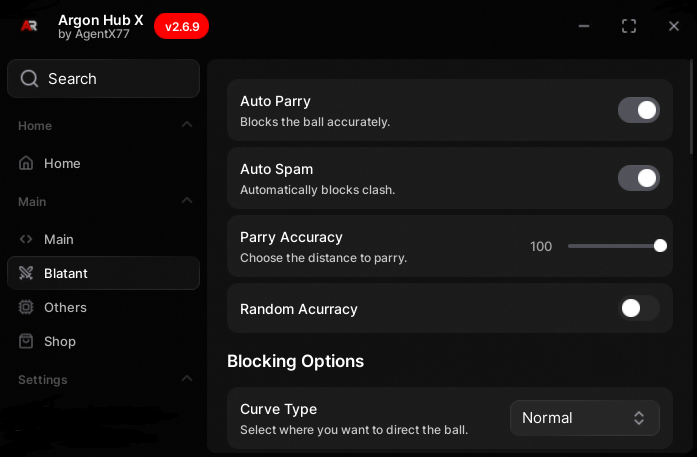

# ArgonHubX

<div align="center">
  

  [](https://reactjs.org/)
  [](https://www.typescriptlang.org/)
  [](https://vitejs.dev/)

  **The most powerful and undetectable script hub for Blade Ball**
</div>

### Installation

1. **Clone the repository:**
   ```bash
   git clone https://github.com/xoscodev/argonhubx.git
   cd argonhub
   ```

2. **Install dependencies:**
   ```bash
   npm install
   ```

3. **Start development server:**
   ```bash
   npm run dev
   ```

4. **Open your browser:**
   Navigate to `http://localhost:xxxx`

### Usage in Blade Ball

1. Copy the loader script:
   ```lua
   loadstring(game:HttpGet("https://raw.githubusercontent.com/AgentX771/ArgonHubX/main/Loader.lua"))()
   ```

---

## Tech Stack

- **Frontend:** React 19.1.1 with TypeScript
- **Build Tool:** Vite 6.2.0
- **Icons:** Custom SVG icons
- **Animations:** CSS animations and React state management

---

## Project Structure

```
argonhub/
├── public/
│   └── herosection.png          # Hero section image
├── components/
│   ├── icons/                   # Custom SVG icons
│   ├── Hero.tsx                # Main hero section with animations
│   ├── Features.tsx            # Features showcase
│   ├── SecuritySection.tsx     # Security information
│   ├── TestimonialsSection.tsx # User testimonials
│   ├── FAQSection.tsx          # Frequently asked questions
│   ├── GetStartedSection.tsx   # Call to action section
│   ├── Footer.tsx              # Site footer
│   └── ...
├── App.tsx                     # Main application component
├── index.tsx                   # Application entry point
├── index.html                  # HTML template
├── package.json                # Dependencies and scripts
├── vite.config.ts              # Vite configuration
├── tsconfig.json               # TypeScript configuration
└── README.md                   # This file
```

---
