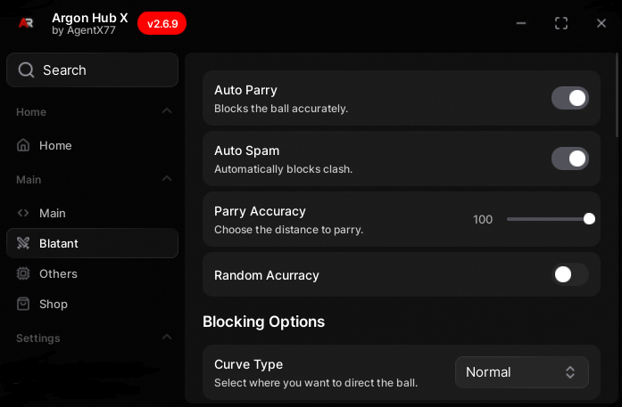

# 🚀 ArgonHub - Ultimate Blade Ball Script Hub

<div align="center">
  

  [](https://reactjs.org/)
  [](https://www.typescriptlang.org/)
  [](https://vitejs.dev/)
  [](https://tailwindcss.com/)

  **The most powerful and undetectable script hub for Blade Ball**
</div>

---

## ✨ Features

### 🎯 **Perfect Auto-Parry**
Never miss a block again. Our flawless auto-parry predicts and counters every incoming attack with perfect timing.

### 🛡️ **Semi-Immortal**
Prevents the ball from killing you, giving you a massive advantage in crucial moments.

### 🔒 **Undetectable & Secure**
Play with confidence. ArgonHub is designed to be undetectable, keeping your account safe from bans.

### 🎨 **Modern UI/UX**
Beautiful, responsive design with smooth animations and interactive elements.

---

## 🚀 Quick Start

### Installation

1. **Clone the repository:**
   ```bash
   git clone https://github.com/yourusername/argonhub.git
   cd argonhub
   ```

2. **Install dependencies:**
   ```bash
   npm install
   ```

3. **Start development server:**
   ```bash
   npm run dev
   ```

4. **Open your browser:**
   Navigate to `http://localhost:5173`

### Usage in Blade Ball

1. Copy the loader script:
   ```lua
   loadstring(game:HttpGet("https://raw.githubusercontent.com/AgentX771/ArgonHubX/main/Loader.lua"))()
   ```

2. Execute it in your Roblox executor

3. Enjoy dominating every match! 🎮

---

## 🛠️ Tech Stack

- **Frontend:** React 19.1.1 with TypeScript
- **Build Tool:** Vite 6.2.0
- **Styling:** Tailwind CSS
- **Icons:** Custom SVG icons
- **Animations:** CSS animations and React state management

---

## 📁 Project Structure

```
argonhub/
├── public/
│   └── herosection.png          # Hero section image
├── components/
│   ├── icons/                   # Custom SVG icons
│   ├── Hero.tsx                # Main hero section with animations
│   ├── Features.tsx            # Features showcase
│   ├── SecuritySection.tsx     # Security information
│   ├── TestimonialsSection.tsx # User testimonials
│   ├── FAQSection.tsx          # Frequently asked questions
│   ├── GetStartedSection.tsx   # Call to action section
│   ├── Footer.tsx              # Site footer
│   └── ...
├── App.tsx                     # Main application component
├── index.tsx                   # Application entry point
├── index.html                  # HTML template
├── package.json                # Dependencies and scripts
├── vite.config.ts              # Vite configuration
├── tsconfig.json               # TypeScript configuration
└── README.md                   # This file
```

---

## 🎮 Game Features

- **Auto-Parry System** - Perfect timing, never miss a parry
- **Semi-Immortal Mode** - Survive impossible situations
- **Undetectable Scripts** - Stay safe while dominating
- **User-Friendly Interface** - Easy to use and configure
- **Regular Updates** - Always improving and adding new features

---

## 🤝 Contributing

Contributions are welcome! Please feel free to submit a Pull Request.

1. Fork the project
2. Create your feature branch (`git checkout -b feature/AmazingFeature`)
3. Commit your changes (`git commit -m 'Add some AmazingFeature'`)
4. Push to the branch (`git push origin feature/AmazingFeature`)
5. Open a Pull Request

---

## 📄 License

This project is licensed under the MIT License - see the [LICENSE](LICENSE) file for details.

---

## ⚠️ Disclaimer

**Use at your own risk.** We are not responsible for any bans or penalties that may occur from using these scripts. Always follow the game's terms of service.

---

<div align="center">
  <p><strong>⭐ Star this repo if you found it helpful!</strong></p>
  <p>Made with ❤️ for the Blade Ball community</p>
</div>
